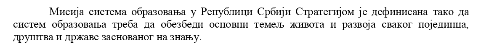

Title: Bog vs Darvin - bitka bez pobednika ili kako nismo razumeli svrhu obrazovanja
Date: 2017-05-15 18:15:00 +0100
Slug: 2017-05-15-creationism-vs-evolution

Ovih dana se ponovo pojavila [polemika](http://rs.n1info.com/a246892/Vesti/Vesti/Posle-13-godina-Srbija-ponovo-muci-muku-s-Darvinom.html) o tome da li deca, uzrasta osmog razreda, treba da izučavaju teoriju evolucije. Da je vrag pojeo šalu, to pokazuje i činjenica da je ova peticija koju potpisuju akademici i doktori, stigla i do Ministarstva i do Skupštinskog odbora za obrazovanje. Pored ovih institucija, reagovali su i Univerzitet u Beogradu i Centar za promociju nauke. 

Međutim, da se ne lažemo, nisu samo kreacionisti u ofanzivnoj fazi. Pre su se mogle pronaći i peticije koje zahtevaju obrnuto - da se verska nastava ukloni iz obrazovnog sistema. Sada običan građanin, obična majka deteta može slobodno da se zapita: šta naša deca uče i da li uče prave stvari. 

Peticije sa obe strane rade upravo ono što niko ne želi - ugrožavaju opštost obrazovanja. Pre 13 godina, ministarka prosvete je isto 
htela da ukloni teoriju evolucije iz nastave biologije sa argumentom "da decu ne treba zbunjivati sa različitim teorijama". Oni koji žele da uklone versku nastavu imaju drugačiji stav a to je da verska nastava nije obrazovanje iz nauke te da nečija religijska opredeljenja
treba da ostanu u 4 zida porodice. Verovatno kao što neki kažu i da LGBT zajednica treba da ostane u svoja 4 zida. 

Sada se postavlja pitanje šta ukloniti, šta dodati i kako izaći na kraj sa toliko teorija, informacija i podataka? Pa prvo, treba da razjasnimo kao društvo čemu obrazovanje uopšte služi, šta očekujemo od istog i na kraju kako ćemo doći do željenog cilja. 

Iz [Akcionog plana razvoja sistema obrazovanja](http://www.mpn.gov.rs/wp-content/uploads/2015/08/Akcioni_plan.pdf) se mogu izvući šta smo kao država definisali za ciljeve i čemu želimo da težimo, u ovom tekstu ću citirati bitan deo iz ovog plana:

Dakle, naš cilj je da kroz obrazovanje naučimo učenike da su sposobni da donose odluke u životu bazirane na znanju. Drugim rečima, mi treba da se fokusiramo na koncepte odlučivanja a ne na ponuđene mogućnosti. Kako sada ovo primeniti na dati primer o izbacivanju Darvina iz udžbenika. Prvo, treba se vratiti na argument bivše ministarke prosvete i tu treba da se složimo da on nema nikakvu osnovu iz prostog razloga što, ako pitate svakog pedagoga, on će vam reći da deca u tom uzrastu mogu da shvate da:

1. postoji više pretpostavki o nastanku,
2. nauka se bavi izučavanjem sveta oko nas i aproksimacijom prirodnih pojava na jednostavne matematičke modele,
3. primenom datih modela za nove hipoteze koje se kasnije eksperimentalno dokazuju pa na osnovu njih se prave novi modeli,
4. proces se ponavlja.

Izbacivanje bilo koje teorije pod izgovorom da je nepotrebna nije naučni pristup i neće doprineti da decu osposobimo da nauče da razmišljaju, da donose odluke bazirane na činjenicama i da budu svestrane ličnosti. 

U obrazovanje je potrebno uvesti jasna pravila, potrebno je držati se ciljeva i na kraju dobro implementirati zadate ciljeve. 
U gradivo treba da uđe svaka teorija, da se izučava način razmišljanja, naučni proces, da se izučava način odlučivanja i da se deca ohrabre da podržavaju različitosti i da ih prevazilaze. Jedino tako ćemo postati zdravo i humano društvo i jedino tako će svaka individua imati mogućnost da sprovede svoje ciljeve.
